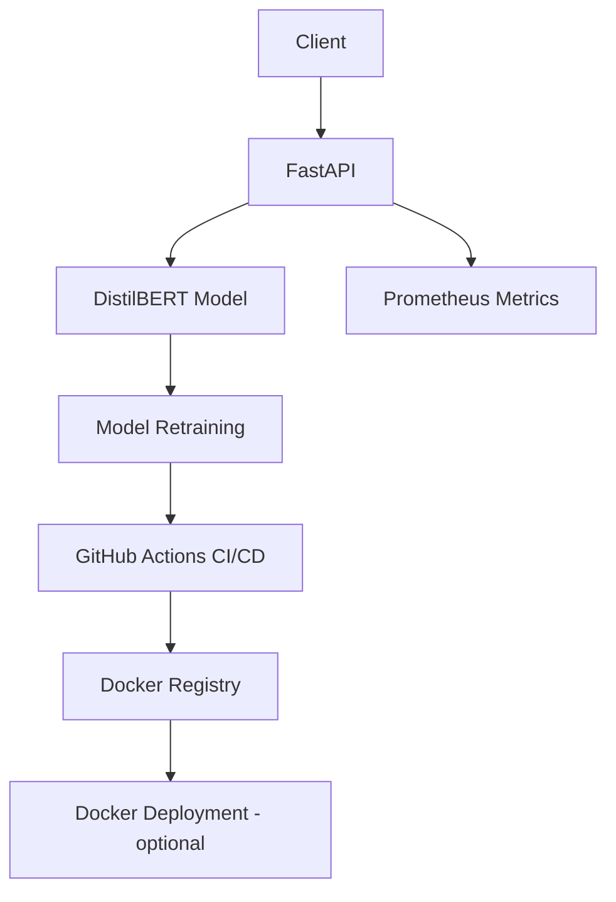

# Sentiment Analysis MLOps Pipeline


An end-to-end MLOps pipeline for sentiment analysis using DistilBERT with automated retraining and deployment.

### Folder Structure After Adding Files
sentiment-analysis-mlops/
├── app/
│ ├── init.py
│ ├── main.py
│ ├── model.py
│ └── logging_config.py
├── monitoring/
│ ├── prometheus.yml
│ ├── grafana-dashboards/
│ │ ├── dashboard.yml
│ │ └── fastapi-dashboard.json
│ └── grafana-datasources/
│ └── datasource.yml
├── docker-compose.monitoring.yml
├── Dockerfile
├── requirements.txt
└── README.md


## Features

- 🚀 FastAPI REST API with Prometheus metrics
- 🐳 Docker containerization with multi-stage builds
- 🔄 CI/CD pipeline with GitHub Actions
- 📊 Model versioning and retraining capabilities
- 🔍 Comprehensive logging and monitoring
- ✅ 90%+ test coverage with Pytest
- 🔒 Secure API endpoints with rate limiting

## Architecture



## Getting Started

### Prerequisites

- Python 3.10+
- Docker
- Git
- curl or Postman (for API testing)

### Installation

#### FastAPI Local Development

# Clone repository
```bash
git clone https://github.com/amitaAlEngineer/sentiment-analysis-mlops.git
cd sentiment-analysis-mlops

# Setup environment
python -m venv venv
source venv/bin/activate  # Linux/Mac
venv\Scripts\activate    # Windows

# Install dependencies
pip install -r requirements.txt

# Run API (development mode)
uvicorn app.main:app --reload
```

#### To run the entire MLOps stack including FastAPI, Prometheus, and Grafana

  1. Go to the Application Directory then run the following
  # Clone repository
  ```bash
  git clone https://github.com/amitaAlEngineer/sentiment-analysis-mlops.git
  cd sentiment-analysis-mlops
  ```
  
  2. Then Run following command
  ```bash
  docker-compose -f docker-compose.monitoring.yml up --build
  ```

  - 🧠 This spins up:

    - The FastAPI app (http://localhost:8000)

    - Prometheus for collecting metrics (http://localhost:9090)

    - Grafana dashboard for visualization (http://localhost:3000)

  # Grafana Login:

    Username: admin

    Password: admin

#### Docker Deployment

```bash
# Production
docker pull  amitakri/sentiment-analysis:latest
docker run -p 8000:8000 amitakri/sentiment-analysis:latest

# Development with hot-reload
docker-compose up --build
```


## API Documentation

Interactive docs available at `http://localhost:8000/docs`

### Endpoints

| Endpoint        | Method       | Description              |
|-----------------|--------------|--------------------------|
| `/` | GET       | Welcome page |
| `/health`       | GET          | Service health check     |
| `/predict`      | POST         | Predict sentiment        |
| `/retrain`      | POST         | Trigger model retraining |
| `/reset-model`  | POST         | Revert to original model |
| `/metrics`      | GET          | Prometheus metrics       |

**Sample Prediction Request:**
```bash
curl -X POST "http://localhost:8000/predict" \
  -H "Content-Type: application/json" \
  -d '{"text":"This movie was fantastic!"}'
```

**Sample Response:**
```json
{
  "sentiment": "POSITIVE",
  "confidence": 0.9987,
  "model": "distilbert-base-uncased-finetuned-sst-2-english",
  "version": "v1.2.0"
}
```

## CI/CD Pipeline

The GitHub Actions workflow includes:

1. **Testing Phase**
   - Unit tests with pytest
   - Code coverage reporting
   - Static code analysis

2. **Retraining Phase**
   - Weekly automated retraining
   - GPU-accelerated training (if available)
   - Model version tracking with MLflow

3. **Deployment Phase**
   - Docker image build and push
   - Kubernetes deployment
   - Canary release strategy

## Monitoring

Access monitoring dashboard at `http://localhost:3000` (if running Grafana)

- **Key Metrics:**
  - API request rate
  - Prediction latency
  - Model accuracy
  - Retraining status

## Contributing

1. Fork the repository
2. Create a feature branch
3. Submit a pull request

